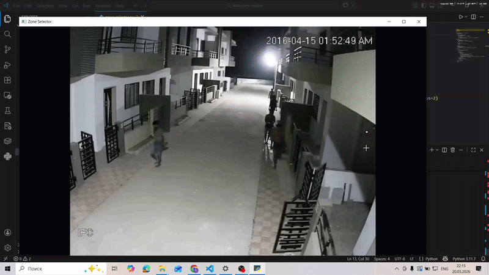
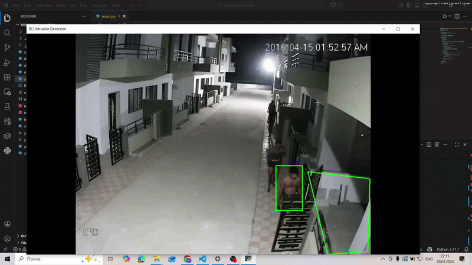

# Система отслеживания проникновений

Проект использует YOLOv8 и OpenCV для обнаружения людей в заранее определенной "запрещенной" зоне на видео.

<table>
<tr>
<td align="center"><b>Zone Selection</b></td>
<td align="center"><b>Video Surveilance</b></td>
</tr>
<tr>
<td align="center"></td>
<td align="center"></td>
</tr>
</table>

## Установка

1.  Клонируйте репозиторий:
    ```bash
    git clone ...
    cd ...
    ```
2.  Создайте и активируйте виртуальное окружение (рекомендуется):
    ```bash
    python -m venv .venv
    source .venv/bin/activate 
    ```
3.  Установите зависимости:
    ```bash
    pip install -r requirements.txt
    ```

## Запуск

Процесс состоит из двух шагов:

### Шаг 1: Разметка запрещенной зоны

Сначала необходимо определить границы запрещенной зоны.

1.  Запустите утилиту разметки:
    ```bash
    python zone_selector.py
    ```
2.  В открывшемся окне левой кнопкой мыши отметьте углы полигона (минимум 3 точки).
3.  Нажмите **'s'** для сохранения зоны. Файл `restricted_zones.json` будет создан.
4.  Нажмите **'r'** для сброса или **'q'** для выхода.

### Шаг 2: Запуск системы обнаружения

После того как зона сохранена, запустите основную программу (используйте main_ds.py для решения с deepsort-ом):

```bash
python main.py
